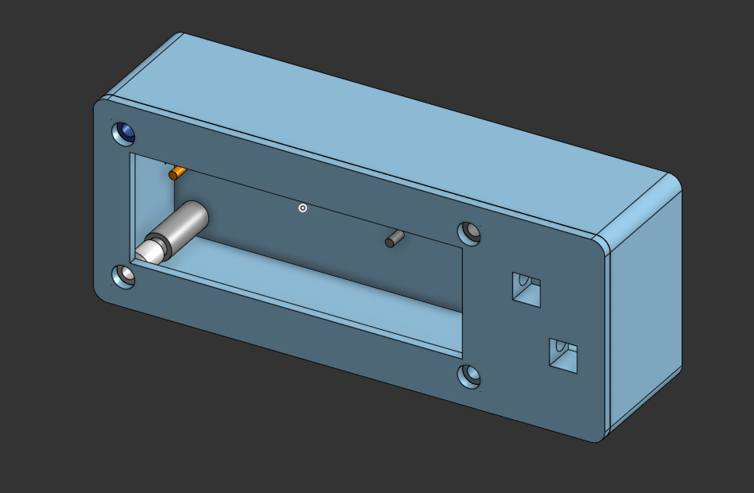
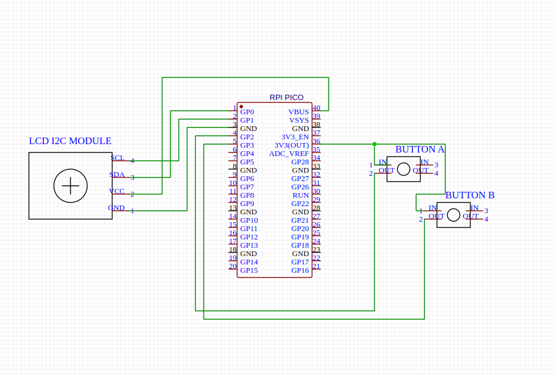

# ALPI-Project
ALPI is a open-source game console you can easily build yourself with a few very cheap components  
You are encouraged to further modify, programm and expand ALPI and to build your own console :)  
- [Components needed](#parts-list)
- [Printed Parts](#cad-and-3d-printing)
- [Electrical Connections](#wiring)
- [Assembly](#assembly)
- [Flash Software](#software)

# CAD and 3D Printing
In the folder 3D you will find the files for CAD and 3D printing.  
Use the .3mf for printing and print with supports.  
online cad : [link](https://cad.onshape.com/documents/39b12044c60763b5ad47779b/w/a6fd5acc249a27e230aecf9f/e/9c9a9dd8f13f00d33f39c59e)

# Parts List

You will need more Parts like cable, heatsetinserts and all the tools e.g. soldering iron, screwdriver.
THESE ARE ONLY THE MAIN PARTS

| Component                                   | Link                                                                                          | Price     |
|---------------------------------------------|-----------------------------------------------------------------------------------------------|-----------|
| Raspberry Pi Pico                           | [berrybase  ](https://www.berrybase.de/raspberry-pi-pico-rp2040-mikrocontroller-board)        | 3,39 €    |
| Alphanumerisches LCD 16x2 with I2C Backpack | [berrybase  ](https://www.berrybase.de/alphanumerisches-lcd-16x2-blau-weiss-mit-i2c-backpack) | 3,90 €    |
| Kurzhubtaster,6x6mm, H 5,0mm                | [berrybase  ](https://www.berrybase.de/kurzhubtaster-vertikale-printmontage-6x6mm-h-5-0mm)    | 0,09 €    |

# Wiring
You can change ALL GPIO Pins but be sure to ALSO CHANGE THE PINS IN THE SOFTWARECONFIG!  
If you wire all the Pins like shown do not change the pin config.

# Assembly
placeholder

# Software