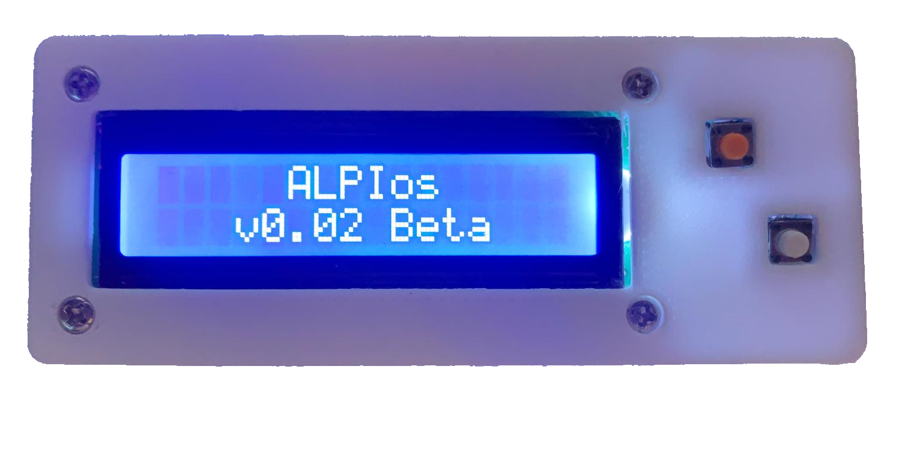

# ALPI-Project
ALPI is a open-source game console you can easily build yourself with a few very cheap components  
You are encouraged to further modify, programm and expand ALPI and to build your own console :)  
- [Components needed](#parts-list)
- [Printed Parts](#cad-and-3d-printing)
- [Electrical Connections](#wiring)
- [Assembly](#assembly)
- [Flash Software](#software)

# CAD and 3D Printing
In the folder 3D you will find the files for CAD and 3D printing.  
Use the .3mf for printing and print with supports.  
online cad : [link](https://cad.onshape.com/documents/39b12044c60763b5ad47779b/w/a6fd5acc249a27e230aecf9f/e/9c9a9dd8f13f00d33f39c59e)

# Parts List

You will need more Parts like cable and all the tools e.g. soldering iron, screwdriver.
THESE ARE ONLY THE MAIN PARTS

| Component                                   | Link                                                                                          | Price per Piece |
|---------------------------------------------|-----------------------------------------------------------------------------------------------|-----------|
| Raspberry Pi Pico                           | [berrybase  ](https://www.berrybase.de/raspberry-pi-pico-rp2040-mikrocontroller-board)        | 3,39 €    |
| Alphanumerisches LCD 16x2 with I2C Backpack | [berrybase  ](https://www.berrybase.de/alphanumerisches-lcd-16x2-blau-weiss-mit-i2c-backpack) | 3,90 €    |
| 2x Button ,6x6mm, H 5,0mm                | [berrybase  ](https://www.berrybase.de/kurzhubtaster-vertikale-printmontage-6x6mm-h-5-0mm)    | 0,09 €    |
| 6x M3 Heatset inserts | [aliexpress](https://de.aliexpress.com/item/1005002897983868.html) | 0,04€ |
| 4x M3 Screw 16mm | [aliexpress](https://de.aliexpress.com/item/4000026671295.html) | 0,05€ |
| 2x M3 Screw 8mm | [aliexpress](https://de.aliexpress.com/item/4000026671295.html) | 0,05€ |

# Wiring
You can change ALL GPIO Pins but be sure to ALSO CHANGE THE PINS IN THE SOFTWARECONFIG!  
If you wire all the Pins like shown do not change the pin config.

# Assembly
- First solder everything as shown in [Wiring](#wiring) beaware that the buttons need longer cables
- There is a small potentiometer at the back of the display on the i2c module. Turn it with a screwdriver while powered on until the boxes are showing slightly.
- Press 4 heatset inserts into the cylinders on the bottom part of the case
- Press 2 heatset inserts into the side of the button holders
- Place the raspberry pi pico onto it´s holder on the bottom part of the case
- Screw 4 16mm screws trough the display holder
- Place the display onto the display holder beaware of the correct display orientation
- Place the buttons into their holders and screw them in with 2 8mm screws
- Put the top part with the display and align the screws with the heatset inserts of the bottom
- Screw the top to the bottom and you are finished :)

# Software

- Download [Thonny](https://thonny.org)
- Connect the console via USB and install micropython via the interpreter configuration
- View -> Files to show the data system
- Upload the 3 python files to the pico
- finished your console is ready to game :)
